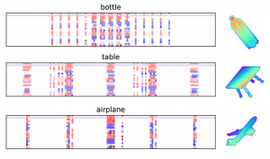

Recently we published a paper on 3D point cloud classification (and segmentation) using our proposed 3D modified Fisher Vector (3DmFV) representation and convolutional neural networks (CNNs).  The preprint is <a href="https://arxiv.org/abs/1711.08241" rel="noopener noreferrer" target="_blank">available on ArXiv</a> and the final version is available in <a href="https://ieeexplore.ieee.org/abstract/document/8394990/" rel="noopener noreferrer" target="_blank">Robotics and Automation Letters (RA-L)</a> journal.

I believe in making research accessible to everyone so I give here a brief explanation about the 3DmFV representation for 3D point clouds.

Before reading this post it is important to have a solid understanding of Gaussian Mixture Models (GMMs), Fisher Vectors (FVs),  and our 3D modified Fisher Vector representation for 3D point clouds. If you are a bit rusty on these subjects I have three previous posts about them:

<ol class="wp-block-list"><li><a href="https://www.itzikbs.com/gaussian-mixture-model-gmm-3d-point-cloud-classification-primer" rel="noopener noreferrer" target="_blank">Gaussian Mixture Models (GMM)</a></li><li><a href="https://www.itzikbs.com/what-is-a-fisher-vector-for-3d-point-clouds-3d-point-cloud-classification-primer" rel="noopener noreferrer" target="_blank">Fisher Vectors (FV)</a></li><li><a href="https://www.itzikbs.com/what-is-3d-modified-fisher-vector-3dmfv-representation-for-3d-point-clouds" rel="noopener noreferrer" target="_blank">3D modified Fisher Vectors (3DmFV)</a> representation for 3D point clouds</li></ol>
<h2 class="wp-block-heading">Related work</h2>

I recently posted a short literature overview of<a href="https://www.itzikbs.com/3d-point-cloud-classification-using-deep-learning" rel="noopener noreferrer" target="_blank"> 3D point cloud classification methods</a>. Most notable ones are PointNet, PointNet++ and K-d Network.

<h2 class="wp-block-heading">3DmFV Representation</h2>

Recall that the 3DmFV representation converts the 3D point cloud  (which is unstructured, unordered and may have a variable number of points) into a special kind of statistical representation on a 3D grid of Gaussians with constant size.

The image below shows a visualization (in 2D, the representation is actually 4D: 3D grid with 20 channels) of the 3DmFV representation for several 3D point clouds. Each column in the image represents a single Gaussian and each row represents a symmetric function over derivative with respects to a Gaussian parameter over the points.

<figure class="aligncenter"><picture>
<source srcset="../../assets/images/blog/fv_pc_3models-300x177-200.webp" type="image/webp"/>

</picture>
<figcaption>3D point clouds  and their corresponding 3DmFV visualizations</figcaption></figure>

<h2 class="wp-block-heading">The Architecture</h2>

Input:  A 3D point cloud (a matrix with n rows and 3 columns representing the XYZ coordinates.

Output: Classification score

The method consists of two main modules:

<ol class="wp-block-list"><li>3DmFV module – converting the 3D point cloud into the 3DmFV representation on a 3D grid.</li><li>Network module – consisting of multiple 3D CNN layers (inspired by inception) followed by several fully connected layers.</li></ol>

The image below summarizes the architecture details.

<figure class="aligncenter"><picture>
<source media="(min-width: 400px)" srcset="../../assets/images/blog/3DmFV_Network_Architecture-1024x199-400.webp" type="image/webp"/>
<source media="(max-width: 399px)" srcset="../../assets/images/blog/3DmFV_Network_Architecture-1024x199-200.webp" type="image/webp"/>

</picture>
<figcaption>3DmFV-Net Architecture</figcaption></figure>

We train and test on the <a href="http://modelnet.cs.princeton.edu/" rel="noopener noreferrer" target="_blank">ModelNet40 /ModelNet10 datasets from Princeton</a>.  It includes 40/10 classes divided into 9843/3991 point clouds for training and 2468/908 point clouds for testing.

<h2 class="wp-block-heading">The Results</h2>

I will not include the charts and tables, if you are interested, make sure to read <a href="https://ieeexplore.ieee.org/abstract/document/8394990/" rel="noopener noreferrer" target="_blank">our 3D point cloud classification paper</a>.  However, I will summarize:

<ol class="wp-block-list"><li>3DmFV-Net achieves good accuracy for point cloud classification.</li><li>It operates in real-time using GPU (despite the representation computation time).</li><li>3DmFV-Net is robust to various types of data corruptions (rotations, outliers, Gaussian noise, occlusions)</li><li>An ablation study reveals that a grid of 8 x 8 x 8 Gaussians is enough to achieve great performance.</li></ol>
<h2 class="wp-block-heading">The Code</h2>

The <a href="https://github.com/sitzikbs/3DmFV-Net" rel="noopener noreferrer" target="_blank">code for training 3DmFV-Net</a> on ModelNet datasets is available on my GitHub repository.

 

